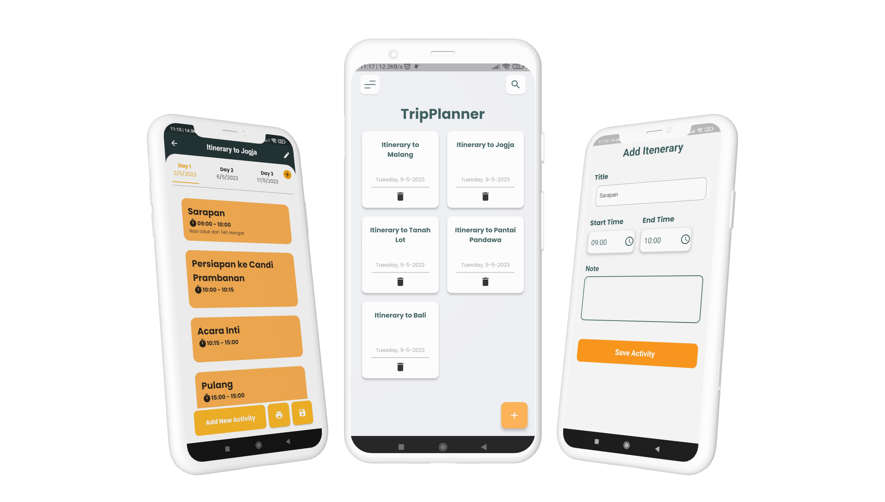

<p align="center">
    
</p>

<h3 align="center">Your Personal Itenerary Assistant</h3>

## 🚀 B3 Agile - Tripplanner - App

#### Kelompok Team Agile yang beranggotakan 7 :
- Lambang Bintoro - 3121500043
- Muhammad Farhan Mustafa - 3121500038
- Hezbi Muhammad Sulaiman - 3121500041
- Muhammad Nuril Huda - 3121500046
- Muhammad Daniel Krisna Halim Putra - 3121500047
- Danny Kurniawan - 3121500057
- Moh. Alfan Alfin - 3121500060


>
Pull in terminal
```
git clone https://https://github.com/MuhNurilHuda/project_scrum_team.git
```

<p>
    <a href="https://play.google.com/store/apps/details?id=com.b3scrumteam.itinerarytrip">
        
    </a> 
</p>

<!-- ## Getting Started

This project is a starting point for a Flutter application.

A few resources to get you started if this is your first Flutter project:

- [Lab: Write your first Flutter app](https://docs.flutter.dev/get-started/codelab)
- [Cookbook: Useful Flutter samples](https://docs.flutter.dev/cookbook)

For help getting started with Flutter development, view the
[online documentation](https://docs.flutter.dev/), which offers tutorials,
samples, guidance on mobile development, and a full API reference.


For help getting started with Flutter development, view the
[online documentation](https://docs.flutter.dev/), which offers tutorials,
samples, guidance on mobile development, and a full API reference. -->
